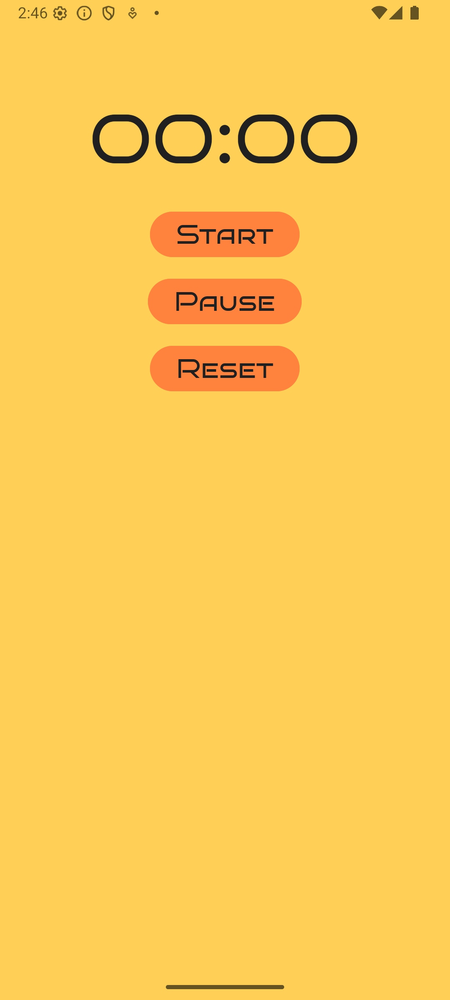

# Stopwatch App ⏱️

A simple and lightweight stopwatch application for Android, built with Kotlin.  
This app allows users to start, pause, and reset a timer to measure elapsed time. Ideal for learning Android development fundamentals, working with timing logic, and structuring projects using clean architecture principles.

## Features

- Start, Pause, and Reset buttons  
- Accurate time tracking in MM:SS format  
- MVVM architecture  
- XML-based UI design

## Tech Stack

- **Language:** Kotlin  
- **UI:** Android XML Layouts  
- **Architecture:** MVVM (Model-View-ViewModel)  
- **Min SDK:** 26+  
- **IDE:** Android Studio

## Screenshot

Here’s how the Stopwatch app UI looks:



## Installation

1. Clone the repository:
   ```bash
   git clone https://github.com/your-username/Stopwatch.git
   ```
2. Open the project in Android Studio.
3. Build and run on a device or emulator with API 21+.

## Acknowledgments

Inspired by O'Reilly's Android development tutorials and official Android documentation.

## Attributions

App icon made by [Edward Boatman](https://thenounproject.com/creator/edward/) from [The Noun Project](https://thenounproject.com)  
Licensed under [CC BY 3.0](https://creativecommons.org/licenses/by/3.0/)

